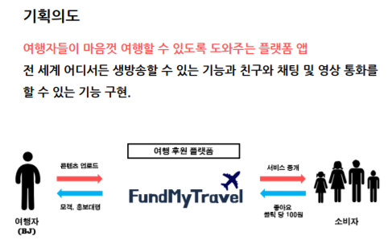
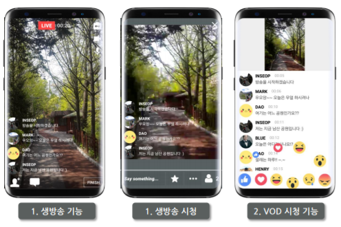
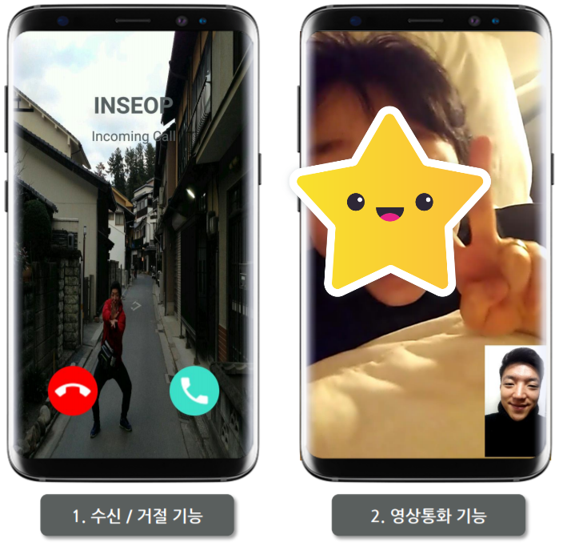
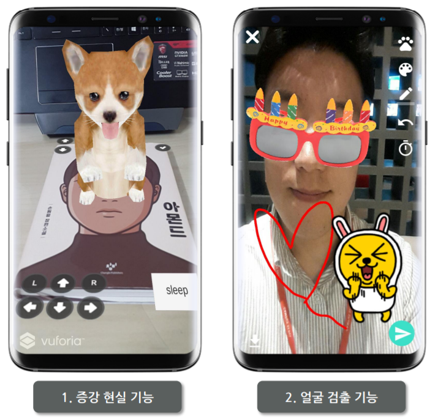
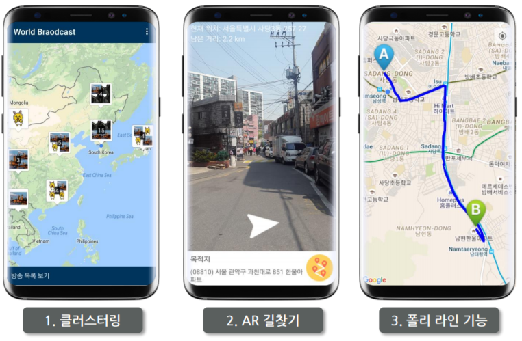
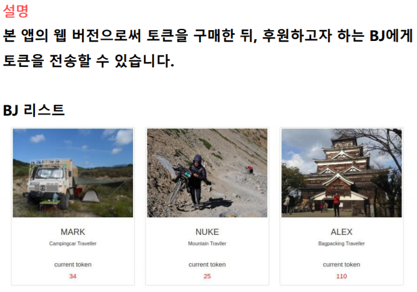
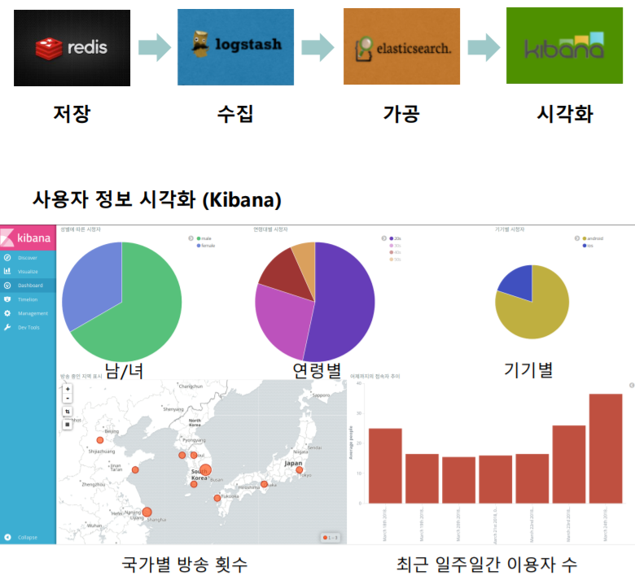

FundMyTravel
===

## [서비스 설명]
실시간 여행 방송 후원 플랫폼

## [사용 기술]
- **웹서버**: Nginx
- **운영체제**: Android, Ubuntu
- **데이터베이스**: PostgreSQL, Redis
- **프로토콜**: TCP/IP, WebRTC, HTTP, RTMP, MPEG-DASH
- **주요 라이브러리/API**
 : Glide / butterKnife / Retrofit2 / FloatingActionButton/ CircularProgressbar / Netty / Google vision API/ Okhttp3 / Argument-Reality / OpenGL / GoogleMaps API / FFMpeg / ExoPlayer / MPAndroid Chart
 
## [주요 기능]
#### 0. 인트로
앱의 주요 기능 설명.

#### 1. 방송
- 카메라 전면/후면 변경
- 채팅 및 별풍선 보내기
- 방송 종료 후 시청자 방송 데이터 시각화
- VOD 시청 기능

#### 2. 영상 통화

#### 3. 사진 메세지 보내기
- 얼굴 검출 후 마스크 씌우기
- 스티커 + 캔버스로 꾸미기

#### 4. 증강현실
- 강아지랑 놀아주기

#### 5. 구글맵
- 클러스터링
- AR 길찾기
- 구글맵에 전체 경로 표시

#### 6. 블록체인
- 토큰 발행
- 토큰 구매하기
- 원하는 BJ에게 토큰 후원하기

#### 7. 로그 데이터 시각화
- NoSQL에 저장되는 사용자 데이터 시각화 하기

'회원가입, SNS로그인, 프로필 사진 변경, 닉네임 변경' 및 여러 예외처리 상황들은 시연에서 제외하였습니다.

## [참고링크]
* [유튜브 - 앱 시현 영상](https://www.youtube.com/watch?v=0jLhfJexEiE&t=209s)
* [깃허브 - 소스](https://github.com/Seopftware/FundMyTravel)